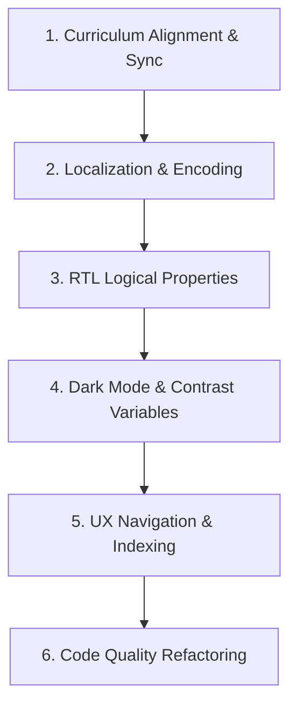

# X7DO0 ACADEMY - COMPLETE WEBSITE AUDIT REPORT
*Master Reference Document for Curriculum Synchronization, Theming, and Refactoring*

---

## EXECUTIVE SUMMARY

This audit is a comprehensive evaluation of the X7do0 Academy codebase. The project is an elegant, static educational platform designed to run on GitHub Pages, featuring custom dark/light theme options and bilingual (English/Arabic) support. 

While the content quality of individual lessons is outstanding, the application currently suffers from **critical architectural mismatches, orphaned data structures, dark-mode accessibility bugs, and localization discrepancies**. 

This document serves as the master reference guide. As per instructions, **no files have been modified or renamed**; this report exposes all current defects and provides a structured action plan for future refactoring.

---

## PHASE 1 — PROJECT UNDERSTANDING

### 1. Folder Structure
The repository is organized under a clean, modular structure typical of lightweight, static GitHub Pages deployments:
```
X7do0-Academy (Root)
├── .gitignore                          # Standard git exclusion configurations
├── .nojekyll                           # Disables Jekyll processing for GitHub Pages (enables folders with underscores)
├── CURRICULUM_ANALYSIS.md              # Preliminary analysis of Python lesson files
├── review.txt                          # Previous execution notes and discovery logs
├── update.bat                          # Batch script for automated git commands
├── index.html                          # Homepage (Academy Hub & landing page)
├── accounts/
│   └── index.html                      # Connect page ( टेलीग्राम / YouTube / Instagram channels)
├── courses/
│   ├── index.html                      # Course catalog page
│   └── python/
│       └── index.html                  # Main Python course viewer page
├── data/
│   └── python-lessons.js               # Database representation (Single source of truth for UI content)
├── assets/
│   ├── favicon.png                     # Browser shortcut icon
│   ├── preview.png                     # OpenGraph social share card image
│   ├── css/
│   │   ├── variables.css               # CSS Custom Properties (Theme tokens)
│   │   └── styles.css                  # Custom structural components & typography overrides
│   └── js/
│       ├── app.js                      # Main lesson-rendering loop and UI interactions
│       └── theme-manager.js            # Global theme (light/dark) & i18n translation system
└── files/
    └── python/                         # Static curriculum download repository
        ├── lesson-01/ through lesson-12/
        │   ├── subject#.py             # Python files teaching concepts
        │   └── challenge#.py           # Practice Python challenges
```

### 2. Page Structure
The application contains four main pages:
1. **Homepage (`index.html`)**: Features an "Academy Hub" core interactive node structure showcasing active (Python) and planned (C++) pathways, structural value pitches, and an instructor bio section.
2. **Courses Catalog (`courses/index.html`)**: A simple card-based grid displaying available courses with active/planned tags and total lesson counters.
3. **Python Course (`courses/python/index.html`)**: The primary content portal, containing an interactive responsive grid container (`#lesson-grid`) that is dynamically populated.
4. **Connect (`accounts/index.html`)**: A profile page compiling support links (personal Telegram, official channel, YouTube, and Instagram).

### 3. Routing
The site uses **static, file-based routing**. Since there is no server-side backend or client-side dynamic router (e.g., React Router), transitions rely on standard anchor elements (`<a href="...">`) pointing to relative HTML file locations (e.g., `../../index.html` or `../courses/index.html`).

### 4. Navigation
- **Global Navbar**: A sticky, blurred-backdrop header (`.navbar-sticky`) shared across all pages, hosting the brand logo, navigation links (Home, Courses, Connect), and UI toggles (Theme and Language).
- **Breadcrumb Navigation**: Placed inside course pages (`Home / Courses / Python`) to provide clear hierarchy.
- **In-Lesson Nav (Missing)**: Currently, there is **no sidebar Index/Table of Contents** or **sequential "Next/Previous Lesson" buttons** inside lessons. All content is placed in one massive scrolling grid.

### 5. Data Files
The database is `/data/python-lessons.js`, which exports a single `lessons` array containing JSON objects. Each object specifies:
- `id` (string): Zero-padded two-digit lesson identifier.
- `title` (string): Title of the lesson.
- `icon` & `color` (strings): Visual identifiers (FontAwesome classes and theme colors).
- `layout` (string): Grid configuration indicators (`grid`, `grid-column`, or default list).
- `items` (array): Nested JSON structures outlining code lines, block types, logic rows, and metadata.
- `files` (object): Direct paths to download resources (`subject` and `challenge` files).

### 6. JavaScript Rendering Logic
- **`theme-manager.js`**: Executes immediately in the document `<head>` to prevent the "dark mode flash" (FOUC). It monitors local storage, sets `data-theme` and `dir="rtl"` properties on `<html>`, toggles language classes (`font-arabic`), and translates DOM elements containing the `data-i18n` attribute.
- **`app.js`**: Imports the `lessons` array from `python-lessons.js`. On `DOMContentLoaded`, it loops through the lessons and dynamically generates complex HTML cards. It binds mouse hover (`mouseenter` / `mouseleave`) and mobile click listeners to elements of class `.keyword` to slide out the code-preview popup (`#code-overlay`) on the right side of the viewport. It also handles the slide-open collapsible panel containing file download buttons (`.toggle-btn`).

### 7. Theme System
The theme system uses **CSS Custom Properties (CSS variables)** declared in `/assets/css/variables.css`. 
- **Light Theme**: The default state, built around soft academic slate backgrounds (`#eef2f6`) and deep navy accents (`#2563eb`).
- **Dark Theme**: Triggered by `[data-theme="dark"]`, changing variables to deep slate (`#0f172a`, `#1e293b`) and lighter, high-contrast blue highlights (`#60a5fa`).
A `transition` property is bound to the `body`, cards, and nav links to ensure smooth color fades.

### 8. Language System
Localization is handled on the client-side. The `ThemeManager` class stores translations in a dictionary mapped to keys (e.g. `welcome_label`, `nav_courses`). Clicking the language toggle flips `localStorage` from `en` to `ar` (or vice-versa). This updates elements with `data-i18n` matching those keys, toggles `dir="rtl"`, and adds `.font-arabic` which overrides default typography with the Google Font **Noto Sans Arabic**.

### 9. Lesson Generation System
The lesson content visible on the screen is **completely generated from JavaScript variables**. The cards do not read from raw `.py` files. Instead, code snippets are copied verbatim as JSON strings in `python-lessons.js`, which `app.js` parses and renders using special helpers (`renderItem`).

### 10. Course Architecture
The course layout operates in a grid that adapts dynamically (1 column on mobile, 2 columns on tablets, 3 columns on wide screens). The individual lessons contain core keyword listings, interactive code triggers, and collapsible directories to download executable Python scripts.

---

## PHASE 2 — PYTHON COURSE AUDIT

This phase cross-references the actual lesson files located in `/files/python/`, the published YouTube course playlist on **@X7do0eng**, the metadata in `data/python-lessons.js`, and the rendered output on the live website.

### Comparison & Status Matrix

| Lesson Number | Lesson Title (Actual File / YouTube / JS / Website) | File Exists | Listed In JS | Visible On Website | Correct Order | Notes / Discrepancies |
| :---: | :--- | :---: | :---: | :---: | :---: | :--- |
| **01** | `01. الطباعة والمخرجات - Print & Output` | Yes | Yes | Yes | Yes | Title is highly consistent across all assets. |
| **02** | `02. أنواع المتغيرات - Variable Types` | Yes | Yes | Yes | Yes | Title is highly consistent. |
| **03** | `03. العمليات الحسابية - Operators` | Yes | Yes | Yes | Yes | YT title is `Operations` (العمليات الرياضية). JS title is `Operators`. |
| **04** | `04. مدخلات المستخدم - User Input` | Yes | Yes | Yes | Yes | YT title is `Input` (الإدخال). JS title is `User Input`. |
| **05** | `05. تحويل الأنواع - Type Casting` | Yes | Yes | Yes | Yes | YT title is `Casting` (تحويل الأنواع). JS title is `Type Casting`. |
| **06** | `06. دمج الدوال - Composition (Function Nesting)` | Yes | Yes | Yes | **No (Pedagogical)** | **Pedagogical Break**: Nesting functions (`int(input())`) is taught *before* custom functions (`def`) in Lesson 09. |
| **07** | `07. الجمل الشرطية - Conditionals` | Yes | Yes | Yes | Yes | Highly consistent. |
| **08** | `08. الحلقات التكرارية - Loops (Iterative)` | Yes | Yes | Yes | Yes | Card uses custom `span: 2` layout, disrupting grid consistency. |
| **09** | `9. الدوال المخصصة - Custom Functions` | Yes | Yes | Yes | Yes | File header uses unpadded prefix `9.` instead of `09.`. |
| **10** | `10. المكتبات - Libraries` | Yes | Yes | Yes | Yes | **Discrepancy**: YT & File titles call it `Libraries / المكتبات`. JS & Website call it `Modules`. |
| **11** | `11. Tupleالقوائم والـ - Lists & Tuples` | Yes | Yes | Yes | **No (Content)** | **CRITICAL DISCREPANCY**: YT & File teach Lists and Tuples. JS & Website call it `Methods` and display string methods! |
| **12** | `12. القواميس والمجموعات - Dictionaries & Sets` | Yes | **No** | **No** | **No (Orphaned)** | **CRITICAL ISSUE**: Files exist, but completely omitted from `python-lessons.js` (invisible on site). |

### Detailed Course Audit Findings
1. **Missing Lessons**: No lessons are completely missing from the filesystem. However, **Lesson 12 (Dictionaries & Sets) is missing from the website UI** because it is omitted from the data file.
2. **Duplicated Lessons**: None.
3. **Wrong Lesson Names & Discrepancies**:
   - **Lesson 10**: The actual file is named `#w 10. المكتبات - Libraries` and the YouTube video is `Python (10) — المكتبات || Libraries`. However, the website displays `Modules`.
   - **Lesson 11**: The actual file is `#w 11. Tupleالقوائم والـ - Lists & Tuples` and the YouTube video is `Python (11) — المصفوفات || Lists & Tuples`. However, the JS database completely overwrote this lesson with **Methods** (`upper()`, `lower()`, etc.), meaning students download lists/tuples code but see string methods on the card.
4. **Lesson Numbering Mismatches**:
   - **Lesson 09**: File header lists `#w 9.` (single digit) while all other files utilize two-digit zero padding (`01`, `02`, etc.).
5. **Orphaned Lessons**:
   - **Lesson 12**: Located in `files/python/lesson-12/` (`subject12.py` and `challenge12.py`). It is a complete lesson, but it is orphaned since there is no matching object in `python-lessons.js`.

---

## PHASE 3 — CONTENT SYNCHRONIZATION AUDIT

The curriculum contains deep architectural mismatches between the educational logic (the python files), the published YouTube order, and the JS data structure feeding the website.

### Mismatch 1: Lesson 11 (Lists & Tuples vs. Methods)
- **Current State**:
  - **Actual File (`subject11.py`)**: Covers lists (len, slicing, append, index, insert, sort, remove, min, max, del) and Tuples (immutability).
  - **YouTube Video**: `Python (11) — Lists & Tuples`.
  - **Website/JS Data**: Displays the title **"Methods"** and contains code snippets for string methods (`upper()`, `lower()`, `capitalize()`, `split()`, `join()`).
- **Expected State**:
  - The website card title should be **"Lists & Tuples"** (or "Lists, Tuples & Methods").
  - The code snippets inside the card should match the actual operations taught in `subject11.py` (slicing, indexing, and tuple restrictions).
- **Probable Cause**:
  - During development, the author wanted to cover string methods but did not want to create a separate Lesson 13. They lazily overwrote the Lesson 11 JS metadata with string methods, neglecting the fact that `subject11.py` was teaching lists and tuples.

### Mismatch 2: Lesson 12 (Dictionaries & Sets Orphaned)
- **Current State**:
  - **Actual Files (`subject12.py`, `challenge12.py`)**: Cover Dictionaries (`key:value`, `.get()`, `.pop()`) and Sets (`add()`, `remove()`, `|`, `&`, `-`).
  - **YouTube Video**: `Python (12) — Dictionary & Set`.
  - **Website/JS Data**: Completely absent. The array ends at Lesson 11.
- **Expected State**:
  - `python-lessons.js` must contain a 12th card configuration object mapping to the lesson-12 folder, so it renders on the main lessons grid.
- **Probable Cause**:
  - The site was pushed to production before the final lesson configurations were completed in the JS data file, leaving the lesson files orphaned in the filesystem.

### Mismatch 3: Lesson 06 (Composition Pedagogical Sequence Break)
- **Current State**:
  - **Actual File (`subject6.py`) / YouTube**: Titled "Composition" or "Function Nesting / دمج الدوال", placed between casting (Lesson 05) and conditionals (Lesson 07).
  - **Educational Concept**: Teaches nested evaluation like `int(input())` and `print(len(str(x)))`.
- **Expected State**:
  - Pedagogically, functional nesting and composition should be taught **after** custom functions (`def`) are introduced in Lesson 09.
- **Probable Cause**:
  - The instructor wanted to show `int(input())` early to build interactive scripts in conditionals and loops, but labeled it "Composition / Function Nesting"—an advanced term—prematurely, breaking the logical prerequisite flow.

---

## PHASE 4 — LANGUAGE AUDIT

The localization and RTL implementation contain critical syntax corruptions and layout presentation issues.

### LANGUAGE ISSUES

#### 1. Corrupted Arabic Characters (UTF-8 Encoding Glitch)
- **Location**: `data/python-lessons.js` — Line 9
- **Current State**: `{ type: "keyword", label: "String (طھظ†طµظٹطµ)", ... }`
- **Expected State**: `{ type: "keyword", label: "String (تنصيص)", ... }`
- **Probable Cause**: The JS file was saved with an incorrect text encoding (such as ANSI or Windows-1256) at some point, corrupting the Arabic word for quotation marks ("تنصيص") into mojibake.

#### 2. Incomplete Lesson Card Translations
- **Location**: `data/python-lessons.js` — All lesson objects
- **Current State**: The `title` strings (e.g. `"Print & Output"`, `"Variable Types"`, `"Conditionals"`) and item `label` properties are strictly hardcoded in English.
- **RTL/Language Toggle Failure**: When a user clicks the "عربي" toggle button, the elements translated via `data-i18n` update correctly (e.g. navbar links). However, the entire lessons grid remains completely in English because the rendering engine (`app.js`) injects values directly from `python-lessons.js` which has no Arabic titles or labels.
- **Expected State**: The data structure should contain bilingual maps for labels, or `app.js` should dynamically handle translation mapping.

#### 3. Hardcoded Layout Elements (RTL Alignment Glitches)
- **Location**: `assets/js/app.js` — Lines 155, 162
- **Current State**:
  - Line 155 contains hardcoded styling: `class="... border-r-2 border-blue-300 mr-2 ..."`
  - Line 162 contains hardcoded styling: `class="... pl-2 border-l-2 border-amber-400 ..."`
- **RTL Bug**: In RTL (Arabic) view, the borders and margins remain physically on the left/right. In RTL, borders for callouts must start on the *right* (the start side of the paragraph), and padding should be on the *right*. 
  - `border-l-2` places the callout indicator line on the left side (the end of the sentence) in Arabic.
  - `border-r-2` places it on the right.
  This looks highly unprofessional. Tailwind logical classes (`border-s-2` for border-start, `ps-2` for padding-start, and `me-2` for margin-end) must be used.

#### 4. Absolute/Physical Alignment Classes in HTML
- **Location**: `accounts/index.html` — Lines 78, 107, 119, 134, 148, 163
- **Current State**:
  - Line 78 & 107 use `pl-6 border-l border-slate-200` to create a divider for toggles. In RTL, the divider remains on the left of the toggles instead of the right.
  - Lines 119, 134, 148, 163 use `ml-auto` to push link icons to the far right. Under RTL flex layout, this physical class disrupts structural spacing.
- **Expected State**: Use logical properties like `ps-6 border-s` and `ms-auto`.

#### 5. Untranslated Header and Page Metadata
- **Locations**:
  - `courses/python/index.html` — Title tag (`<title>Python Core | X7do0 Academy</title>` is hardcoded in English).
  - `courses/python/index.html` — Header title (`Python <span class="text-academic-accent">Notes</span>` is hardcoded in English with no `data-i18n` attribute).
  - `courses/index.html` & `courses/python/index.html` — Footers are missing translation bindings.

---

## PHASE 5 — DARK MODE AUDIT

The dark theme possesses several severe color contrast violations and rendering bugs that make elements hard to read or completely invisible.

### DARK MODE ISSUES

#### 1. White Blinding Code Preview Popover
- **Location**: `courses/python/index.html` — Lines 64-82 (`#code-overlay` container)
- **Current State**: The outer container of the code-preview window is hardcoded with light-theme tailwind classes: `class="bg-white border border-blue-100 shadow-xl..."` and the header is `bg-slate-50 border-b border-slate-100`.
- **Dark Mode Bug**: In Dark Mode, when a user hovers over a keyword, a bright, blinding white box pops up on the right side of the screen. This contrast flash is incredibly jarring on a dark navy background.
- **Expected State**: The container should use semantic variables or tailwind dark classes: `dark:bg-slate-900 dark:border-slate-800`.

#### 2. Blinding Collapsible File Download Buttons
- **Location**: `assets/js/app.js` — Lines 83, 97
- **Current State**: In the dynamically rendered lists of files, download cards are hardcoded as `bg-slate-50 hover:bg-white border-slate-200`. The file icons use `bg-blue-100 text-blue-600` and `bg-purple-100 text-purple-600`.
- **Dark Mode Bug**: In dark mode, expanding "Files & Resources" displays blindingly white cards that turn solid white on hover. The bright backgrounds and white hover states completely overpower the dark viewport.
- **Expected State**: Buttons must utilize semantic color tokens (e.g. `bg-academic-surface` or `dark:bg-slate-800 dark:hover:bg-slate-700`).

#### 3. Low Contrast Title Headers (Unreadable Text)
- **Location**: `assets/js/app.js` — Line 21
- **Current State**: The titles of the lesson cards are hardcoded with `text-blue-900`:
  `<h3 class="text-lg font-bold text-blue-900 ...">`
- **Dark Mode Bug**: In dark mode, the card background shifts to dark slate (`--bg-card: #1e293b`). The hardcoded `text-blue-900` text becomes almost black, leading to a severe contrast ratio violation (1.2:1) that makes card titles completely unreadable!
- **Expected State**: Should use `--text-primary` (which is `#f1f5f9` in dark mode) or Tailwind's `dark:text-white`.

#### 4. Blinding Callout Alerts
- **Location**: `assets/js/app.js` — Lines 63, 155, 162, 191
- **Current State**: Extra info callouts and alerts utilize hardcoded bright background variables (`bg-blue-50/50`, `bg-red-50`, `bg-amber-50`, `bg-slate-50`).
- **Dark Mode Bug**: In dark mode, these boxes display as bright, saturated light-colored rectangles, clashing heavily with the navy theme.
- **Expected State**: Use transparent dark tones (`dark:bg-red-950/20`, `dark:border-red-900/50`, etc.).

#### 5. Keyword Bubble Theme Override Bug
- **Location**: `assets/js/app.js` — Line 129 (`blockStyle` definition)
- **Current State**: `blockStyle` contains hardcoded `bg-slate-50 border-slate-200`.
- **Dark Mode Bug**: While `styles.css` declares `.keyword` using theme variables (`var(--code-bg)` and `var(--code-border)`), the JS rendering engine injects physical tailwind utility classes (`bg-slate-50` and `border-slate-200`) directly on the element. These Tailwind utility classes override the custom CSS properties, causing the keywords to render as light-colored bubbles even when dark mode is enabled!
- **Expected State**: Remove hardcoded background utility classes from the JS script.

---

## PHASE 6 — UI / UX AUDIT

We rank all layout, spacing, and interface bugs based on severity:

### 1. Critical Severity (Must be repaired immediately)
- **Title Mismatches (Lesson 11 Content Mismatch)**: The website card says **"Methods"** and displays string methods, but downloading the lesson file yields `subject11.py` which is all about **Lists & Tuples**. A student trying to study lists will be completely confused.
- **Orphaned Lesson 12**: Lesson 12 exists in the codebase but is inaccessible to users, creating an incomplete course pathway.
- **Dark Mode Card Titles (Low Contrast)**: Card titles rendering as dark blue on a dark gray card background, rendering them practically invisible to readers.

### 2. High Severity (Major usability or styling defects)
- **Blinding Dark Mode Popups**: The `#code-overlay` and file download buttons remain blinding white in dark mode.
- **Bilingual Render Failures**: Clicking the Arabic button does not translate the actual content of the lessons.
- **Pedagogical Flow Disruption (Lesson 06 Placement)**: Teaching nested functional composition before students understand custom functions.

### 3. Medium Severity (Inconsistent styling or layout)
- **Lesson 08 Loop Grid Break**: The loops card occupies 2 grid columns due to custom JS definitions (`span: 2`, `layout: "grid-column"`), causing the masonry/flex grid layout to look visually stretched and unbalanced compared to other cards.
- **Physical Padding/Margin Layout Bugs in RTL**: Margins (`ml-auto`) and borders (`border-l-2`) failing to mirror, causing off-center alignments in Arabic mode.

### 4. Low Severity (Cosmetic cleanups)
- **Missing Navigation Elements**: No "Next Lesson" or "Previous Lesson" sequential links.
- **Title Padding Prefix**: Lesson 09 file starts with `9.` instead of `09.`.
- **Dead Localization Keys**: `"footer_copy"` remains in translations dictionary, despite copyright text being removed from the HTML pages.

---

## PHASE 7 — CODE QUALITY AUDIT

### 1. Dead / Unused Code
- **`variables.css` & `styles.css`**: The `.glass-card` selector is completely unused by active elements (which use `.academic-card`), but is kept "for backward compatibility during refactor."
- **`theme-manager.js`**: Holds translation keys like `"footer_copy"`, `"desc_tg_personal"`, `"desc_tg_channel"` which are no longer bound to any active HTML text nodes.

### 2. Code Duplication
- **Verification of HTML Headers**:
  The Tailwind CDN, font loading links, CSS stylesheet imports, and the entire `tailwind.config` block are duplicated across **four separate HTML files**:
  - `index.html`
  - `courses/index.html`
  - `courses/python/index.html`
  - `accounts/index.html`
  This duplication is a massive maintenance burden. Any change to the global styling variables or font imports requires manual modification across 4 files.
- **Navigation Duplication**:
  The global `<nav class="navbar-sticky">` navigation header markup is duplicated in all 4 HTML documents.

### 3. Unused CSS & JS
- Standard CSS styles are highly optimized, but Tailwind and FontAwesome CDNs are loaded globally even on pages that do not require heavy scripting (like the static accounts index page).

### 4. Hardcoded Layout Values
- As outlined in the Dark Mode and Language audits, `app.js` is riddled with hardcoded light-mode background classes and physical direction properties that override clean CSS variables.

### 5. Architectural Inconsistencies
- **Filesystem Naming Inconsistency**: The lesson folders are named using padded two-digit values (`lesson-01`, `lesson-02`), but the actual Python files inside omit the padding (`subject1.py`, `challenge1.py`). In contrast, Lesson 10 has `subject10.py` and `challenge10.py`.
- **Prefix Discrepancy**: The title in `subject9.py` has `#w 9.` while other headers are properly zero-padded (`#w 01.`, `#w 02.`).

---

## PHASE 8 — ACTION PLAN

This section provides the exact technical steps needed to repair the application.

### RECOMMENDED REPAIR ORDER

To ensure structural safety, alignment, and theme stability, the repairs must be completed in the following order:



#### 1. Fix Curriculum Synchronization & Alignment (P0 - Critical)
- **Step 1 (Register Lesson 12)**: Add the Lesson 12 object to `data/python-lessons.js` using ID `"12"`, title `"Dictionaries & Sets"`, color `"blue"`, and proper file links to `subject12.py` and `challenge12.py`.
- **Step 2 (Sync Lesson 11 Metadata)**: Rename Lesson 11 in `data/python-lessons.js` to `"Lists & Tuples"` and update its interactive code items to align with lists/tuples slicing and indexing concepts taught in `subject11.py`.
- **Step 3 (Reorder Lesson 06)**: Move the Lesson 06 (Composition) object to come *after* Lesson 09 (Custom Functions) inside the lessons array in `python-lessons.js`. Swap IDs to preserve sequential number displays.
- **Step 4 (Standardize Names)**: Rename JS Title for Lesson 10 to `"Libraries"` to match YouTube and `subject10.py`. Add the missing zero-padded `0` to `subject9.py`'s `#w 09.` header.
- *Why first?* Fixing the curriculum data structure is the fundamental layer. Implementing styling, translation, or navigation systems before having the correct lessons in place will result in wasted effort and broken views.

#### 2. Fix Localization, Encoding, and Text Errors (P0 - Critical)
- **Step 5 (Fix UTF-8 mojibake)**: Edit `python-lessons.js` line 9 to replace `"String (طھظ†طµظٹطµ)"` with `"String (تنصيص)"`. Save the file strictly with **UTF-8 encoding**.
- **Step 6 (Implement Translation Mapping)**: Upgrade the `lessons` array in `python-lessons.js` to support bilingual titles and labels (e.g. `{ title_en: "Print & Output", title_ar: "الطباعة والمخرجات" }`).
- **Step 7 (Update Dynamic Rendering)**: Modify `app.js` and `theme-manager.js` to listen for language toggle clicks and re-render the lesson grid in the selected language. Add translations for browser titles and headers.
- *Why second?* Resolving text corruptions and enabling correct translation mapping ensures that the text displays correctly in both English and Arabic before adjusting layout alignments.

#### 3. Fix RTL Logical Spacing and Borders (P1 - High)
- **Step 8 (Remove Physical Spacers)**: Search all files for `ml-auto` or `mr-auto` and refactor to `ms-auto` or `me-auto`.
- **Step 9 (Fix Callout Borders in RTL)**: In `app.js` and HTML files, refactor direction-specific parameters like `border-l-2` / `border-r-2` and `pl-2` / `pr-2` to logical `border-s-2` and `ps-2`.
- *Why third?* Logical spacing rules adapt automatically to layout flows. Applying logical classes before coloring components ensures structural integrity across both viewports.

#### 4. Fix Dark Mode Contrast & Variables (P1 - High)
- **Step 10 (Restore Keyword Theme)**: In `app.js` (Line 129), remove the hardcoded tailwind classes `bg-slate-50` and `border-slate-200` from `blockStyle` to allow keyword bubbles to inherit custom CSS variables (`--code-bg`, `--code-border`) correctly in dark mode.
- **Step 11 (Fix Contrast Flashes)**: Replace physical colors inside `app.js` files list (`bg-slate-50 hover:bg-white border-slate-200`) and overlay (`bg-white border-blue-100`) with semantic CSS variables (`bg-academic-bg`, `border-subtle`, etc.) or Tailwind dark mode utilities (`dark:bg-slate-900 dark:border-slate-800`).
- **Step 12 (Fix Text Title Visibility)**: Change `text-blue-900` in dynamic card headers to `text-academic-primary` or add `dark:text-white`.
- *Why fourth?* Visual theming directly affects readability. Doing this after the layout structure is stable ensures elements are visually accessible.

#### 5. Implement Sequential Navigation & Visual Spans (P2 - Medium)
- **Step 13 (Loops Grid Span)**: Refactor Lesson 08's grid-column data structure to fit into a single standard grid span, or split loops into two distinct lessons to preserve visual symmetry in the 3-column grid.
- **Step 14 (Add Sidebar & TOC)**: Create a sticky index/Table of Contents sidebar on the Python course viewer page to allow jumping between lessons.
- **Step 15 (Sequential Flow Buttons)**: Add "Previous" and "Next" buttons at the footer of each card container.
- *Why fifth?* Navigation elements add visual markup. These polish items are safest to add once the base grid structure is fully styled.

#### 6. Code Refactoring & DRY (P2 - Medium)
- **Step 16 (Deduplicate HTML Headers)**: Extract repeating Google Fonts imports, Tailwind scripts, and configurations into a shared JS layout loader, or clean up unused CSS classes (e.g. `.glass-card`).
- *Why last?* Code cleanup is a maintenance step. Performing this last ensures no active code is deleted during the refactoring process.

---
*Audit Completed: May 31, 2026*  
*Inspector Signature: Antigravity AI*
